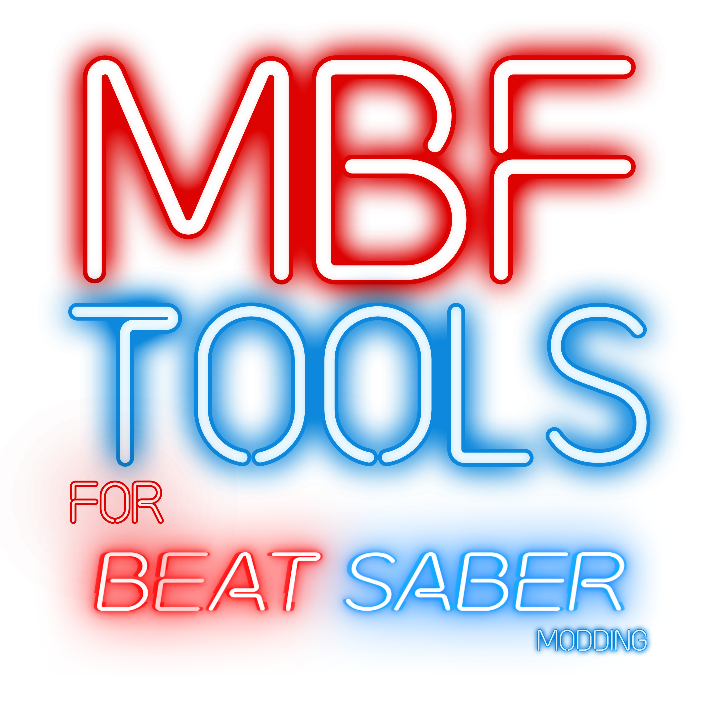

<p align="center">
  
</p>

# MBF Tools and Setup

> **Download:** [mbf.tools](https://mbf.tools)

Single-app Quest setup, support, and MBF integration for [mbf-launcher](https://github.com/DanTheMan827/mbf-launcher).

---

## What it does

- **Guided on-headset setup** — step-by-step wizard for Android dev mode, Wireless Debugging, and ADB pairing. Real-time status checks at each step.
- **Wireless ADB pairing** — enter the 6-digit code from Wireless Debugging; the app detects pairing and debug ports automatically.
- **Integrated MBF** — starts the upstream MBF native bridge locally and opens the live MBF web app in a built-in browser.
- **Live support hub** — live FAQ and fix form from the wiki, available without leaving the app.
- **Performance controls** — adjust CPU, GPU, and refresh rate over ADB with presets (Battery / Balanced / Max).
- **Debug log sharing** — one-tap export sends a diagnostic payload to support with a share code.

---

## Install (Quest headset)

1. Open the Quest browser and go to **https://smokeslate.github.io/MBF-Tools**.
2. Tap **Download APK**.
3. Install via the Files app → package installer.
4. Find **MBF Tools and Setup** under Unknown Sources.

---

## Build locally

**Debug (install to connected device):**
```powershell
.\build-and-push.ps1
```

**Signed release APK:**
```powershell
.\setup-release-signing.ps1 # one-time migration/setup only
.\build-release.ps1
```

The one-time setup moves signing credentials out of the repository, creates an
Android proof-of-rotation lineage, and stores the new credentials encrypted to
the current Windows user under `%LOCALAPPDATA%\MBFTools\Signing`. Normal release
builds only require `.\build-release.ps1` after that setup is complete.

---

## Architecture

| Layer | Technology |
|---|---|
| Android app | Kotlin, XML layouts, View Binding |
| Backend | Cloudflare Worker (`/api`) |
| ADB bridge | Upstream MBF native binary |
| WebView target | Live MBF web app (external) |

Key classes: `LauncherActivity`, `HomeActivity`, `GuideActivity`, `MainActivity` (ADB/debug screen), `BrowserActivity`, `AdbManager`, `SetupState`, `DiagnosticsCollector`.

---

## Links

- **Wiki:** [wiki.sm0ke.org](https://wiki.sm0ke.org)
- **MBF Tools page:** [wiki.sm0ke.org/#/mbftools](https://wiki.sm0ke.org/#/mbftools)
- **Discord:** [d.sm0ke.org](https://d.sm0ke.org)
- **mbf-launcher:** [github.com/DanTheMan827/mbf-launcher](https://github.com/DanTheMan827/mbf-launcher)

---

MIT License
